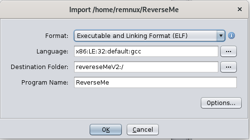
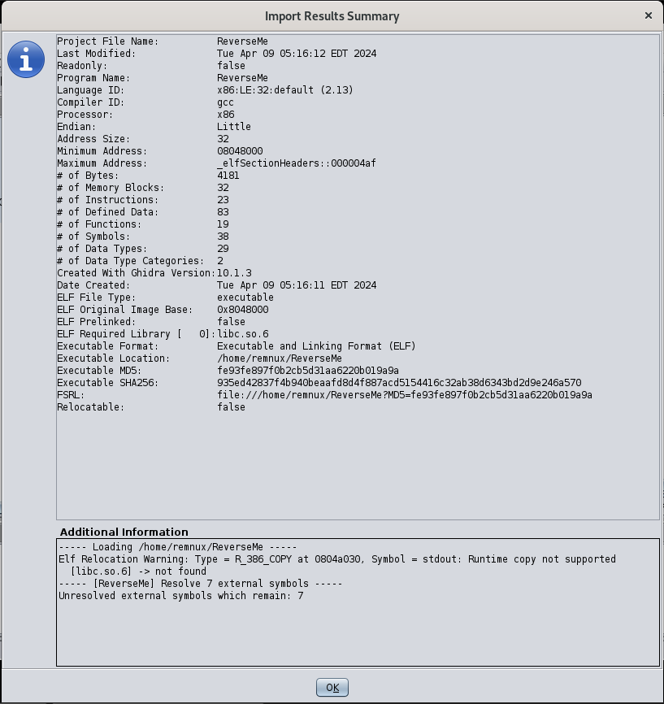

# Reverse engineering challenge ReverseMe

Presented in the course *Hackerspace* on the Cybersecurity masters Aalborg University.

## Introduction to the challenge

The ReverseMe binary is a C program compiled for ELF systems. The intent is to use Ghidra to reverse engineer the program and eventually obtain the "Corp secret" which is used to grant access to the program.

### Solving the challenge

Importing the file into Ghidra provides a lot of information, including the compiler used, architecture, address size and endian. Endian can be important as this denotes how values are stored in memory.



First we use the *Defined Strings* utility in Ghidra to examine what plaintext values we can find. This tool is found under `window -> Defined Strings`. It will open a new window highlighting all the strings Ghidra can find. These are clickable and leads the assembly viewer to the instructions where the string is used. Particularly exciting strings in this case could be `Access` or `granted!`. As the function using these strings, might tell us something about how to authenticate.



Going to `Access` in the assembly shows us the following code:

```Assembly
                             s_Access_080487d1                               XREF[1]:     FUN_08048563:080485d9(*)  
        080487d1 41 63 63        ds         "Access"

```

Notice here the `XREF[1]`. This points denotes that this string is being referenced by one function. Clicking on `XREF[1]` Will jump to this function in the assembly AND Ghidra will show the decompiled function as it understands the code, in the decompiler window.

The decompiler shows:

```C
undefined4 FUN_08048563(int param_1,int param_2)

{
  size_t sVar1;
  uint local_14;
  
  if (param_1 == 2) {
    sVar1 = strlen(*(char **)(param_2 + 4));
    if (sVar1 == 4) {
      DAT_0804a038 = **(uint **)(param_2 + 4);
    }
    printf("Your UID is: %d\n",DAT_0804a038);
    DAT_0804a038 = (DAT_0804a038 >> 0x10 | DAT_0804a038 << 0x10) + 0xed28f022;
    printf("Access");
    if (DAT_0804a038 == 0x216e6957) {
      for (local_14 = 0; sVar1 = strlen("..."), local_14 <= sVar1; local_14 = local_14 + 1) {
        fprintf(stdout,"%c\a",(int)(char)(&DAT_080487d8)[local_14]);
        fflush(stdout);
        sleep(1);
      }
      puts("granted!!\n");
      fflush(stdout);
      sleep(1);
      puts("Win!");
      return 0;
    }
    for (local_14 = 0; sVar1 = strlen("...denied!!\n"), local_14 <= sVar1; local_14 = local_14 + 1)
    {
      fprintf(stdout,"%c\a",(int)"...denied!!\n"[local_14]);
      fflush(stdout);
      sleep(1);
    }
  }
  else {
    puts("Please supply your corp. secret");
  }
  return 1;
}
```

Here we see that the variable `DAT_0804a038` is checked against a constant hex value `0x216e6957`. This is our first clue, we need to input a Corp secret, which will eventually match the constant hex value. Simply doing `From hex: 0x216e6957` on cyberchef will provide us the plaintext value of `0x216e6957` which is: `!niW`.

Next step is to follow the `DAT_0804a038` variable in order to see how it is mutated throughout the program.

The first line involving `DAT_0804a038` when tracing back is: `DAT_0804a038 = (DAT_0804a038 >> 0x10 | DAT_0804a038 << 0x10) + 0xed28f022;`. Here we see that the input is mutated by being shifted by 16 bits in both directions (left and right) then after this, the bitwise operator `OR` is used. Lastly another hex constant is added to the input. We need to reverse this, meaning doing the opposite. So we subtract the hex constant and from our `!niW` (here we need to mind the unsigned nature of the int). To calculate this, I wrote a very short python script:

```python
win = 0x216e6957
extra_num = 0x12d70fde

result =  win + extra_num

print(hex(result))
```

As you probably notice, we are not subtracting in this script. This is because the compiler has made some optimizations, and if we inspect the assembly, where the hex constant is added to our input, we see that it is subtracting, not adding. This is due to the values being unsigned, and the code subtracting a larger value from the input will result in a negative value. This cannot happen with unsigned values, meaning the value wraps around (essentially an overflow). The compiler made this easier to do, by just subtracting the value which would be equivalent to adding a larger number:

```assembly
        080485cf 2d de 0f        SUB        EAX, 0x12d70fde
```

Notice the value of the subtracted constant. This value we have to add to our input (as we are reversing the steps).

Then it is time for shifting the input. Essentially shifting a 32 bit value by 16 in both directions and then using OR will result in a *swap*. It looks like this:

```bit
original hex (after subtraction): 34457935
right_shift: 00003445
left_shift:  79350000

right_shift OR left_shift ~ 00003445 or 79350000 = 79353445
```

This value is our input. Converted to ascii: `y54E`.

You should think that we were done with this challenge. But the pesky endian I mentioned earlier will be trouble on the currently running architecture??. Depending on the CPU, the value is stored using either big endian or little endian.

If it is little endian, this means that the least significant value will be stored on the first position in memory when storing multi byte values. Thus we have to reverse our input, in order for it to be parsed correctly.
This happens because the ascii value we provide, is converted to an integer: `undefined4 FUN_08048563(int param_1,int param_2)` in param 2.

**NOTE**: To view your memory endiannes on linux, use `lscpu | grep "Byte Order"`

`Solution: ./ReverseMe E45y`
